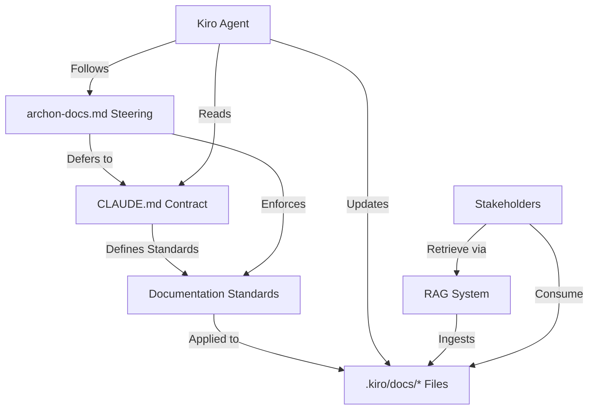

# Design Document: Archon Documentation Foundation Refinement

## Overview

This design specifies how to refine the Archon documentation foundation by enhancing both `CLAUDE.md` (the documentation contract) and `.kiro/steering/archon-docs.md` (the steering file) to align with the archon-docs power's full capabilities. The refinement ensures optimal documentation generation and management for automated agents and system stakeholders.

The design focuses on two primary artifacts:
1. **CLAUDE.md** - The authoritative contract that defines what documentation standards must be met
2. **archon-docs.md** - The always-active steering that enforces those standards during all Kiro tasks

## Architecture

### Component Relationships



### Design Principles

1. **Single Source of Truth**: CLAUDE.md is the authoritative contract; steering enforces it
2. **Stable Structure**: Maintain exactly 6 documentation files, never create new ones
3. **Stakeholder-Focused**: Optimize for engineers, operators, and RAG agents
4. **Retrieval-Optimized**: Structure content for optimal RAG retrieval (headings as keys, 400-800 token chunks)
5. **Grounded in Reality**: All documentation must reference actual code and infrastructure
6. **Incremental Maintenance**: Update existing sections rather than wholesale rewrites

## Components and Interfaces

### Component 1: Enhanced CLAUDE.md Contract

**Purpose**: Define comprehensive, authoritative documentation and code quality standards

**New Sections to Add**:

1. **Documentation Stability Principle**
   - Explicitly state the 6-file limit
   - Prohibit creating new documentation files
   - Specify where new features should be documented

2. **Stakeholders and Usage**
   - Identify stakeholder types (engineers, operators, RAG agents)
   - Describe how each stakeholder uses the documentation
   - Provide optimization guidance for each stakeholder type

3. **Documentation Maintenance Philosophy**
   - Prioritize updating existing sections over creating new files
   - Emphasize incremental updates over large rewrites
   - Mandate removing stale content rather than adding alongside it
   - Explain the "6 stable files" principle

4. **Retrieval Optimization Strategy**
   - Explain headings as retrieval keys
   - Require descriptive, specific headings
   - Mandate consistent terminology across files
   - Specify grouping related information

5. **Documentation Refactoring**
   - Specify maximum section size (~1000 tokens)
   - Provide refactoring triggers
   - Include refactoring patterns (split into subsections, move to different file)

6. **Quality Validation Checklist**
   - Grounding: All statements have code references
   - Structure: Sections are 400-800 tokens, headings are descriptive
   - Consistency: Terminology matches across files
   - Completeness: All affected files are updated

7. **Code Quality Standards**
   - Prohibit breadcrumb comments
   - Require expressive naming
   - Recommend method sizing (10-30 lines, preferably <20)
   - Encourage helper methods
   - Specify minimal, purposeful commenting
   - Reference Clean Code principles with pragmatism

8. **Examples and Anti-Patterns**
   - Show well-structured vs. poorly-structured sections
   - Demonstrate good vs. bad headings
   - Illustrate proper provenance formatting
   - Cover examples for all 6 core files

**Enhanced Sections**:

- **Required Documentation Files**: Add detailed descriptions of what belongs in each file
- **Provenance**: Strengthen requirements for specific file references
- **Contract Authority**: Explicitly state final authority and reference steering as enforcement

### Component 2: Enhanced archon-docs.md Steering

**Purpose**: Provide always-active enforcement and guidance for documentation standards

**New Sections to Add**:

1. **Documentation Audit Workflow**
   - Step 1: Understand the system (scan code, infra, existing docs)
   - Step 2: Audit documentation (identify gaps, stale content, oversized sections)
   - Step 3: Plan before rewriting (propose changes as bullet list)
   - Step 4: Implement incrementally (small, focused updates)

2. **Cross-File Consistency Requirements**
   - Require checking all affected files when making updates
   - Mandate consistent terminology across all files
   - Require updating related sections in multiple files
   - Provide cross-file checking prompts

3. **Common Update Patterns**
   - New Component Pattern:
     - Update `architecture.md` (add component description)
     - Update `operations.md` (add deployment/monitoring)
     - Potentially update `api.md` (if exposes interfaces)
     - Potentially update `data-models.md` (if uses schemas)
   
   - New Endpoint Pattern:
     - Update `api.md` (add endpoint documentation)
     - Potentially update `architecture.md` (if new component)
   
   - Schema Change Pattern:
     - Update `data-models.md` (update schema documentation)
     - Potentially update `architecture.md` (if affects design)
   
   - Decision Tree: Provide flowchart for determining which files need updates

4. **Documentation Refactoring Guidance**
   - Detect oversized sections (>1000 tokens)
   - Prompt refactoring with specific steps
   - Guide splitting into subsections
   - Guide moving content to different files

5. **Code Quality Enforcement**
   - Flag breadcrumb comments for removal
   - Suggest refactoring methods exceeding 30 lines
   - Enforce expressive naming
   - Remind about minimal commenting

6. **Stakeholder Reminders**
   - Remind to consider all stakeholders when updating
   - Prompt optimization for RAG retrieval
   - Ensure content serves engineers and operators

**Enhanced Sections**:

- **Repository Structure**: Add enforcement language for 6-file limit
- **Workflow Integration**: Add cross-file consistency checks
- **RAG-Friendly Documentation Rules**: Add heading quality and terminology consistency enforcement

### Component 3: File Structure and Organization

**CLAUDE.md Structure** (Enhanced):
```markdown
# Archon Documentation Contract

## Documentation Location
## Documentation Stability Principle [NEW]
## Required Documentation Files
## Documentation Maintenance Philosophy [NEW]
## Stakeholders and Usage [NEW]
## Documentation Standards
  ### Grounding in Code
  ### RAG-Friendly Structure
  ### Retrieval Optimization Strategy [NEW]
  ### Provenance
  ### No Hallucinations
  ### Avoid Duplication
  ### Documentation Refactoring [NEW]
## Code Quality Standards [NEW]
  ### Naming Conventions
  ### Method Sizing
  ### Commenting Guidelines
  ### Clean Code Principles
## Quality Validation Checklist [NEW]
## Examples and Anti-Patterns [NEW]
## Security
## Kiro Integration
## Contract Authority
```

**archon-docs.md Structure** (Enhanced):
```markdown
# Archon RAG Documentation Standards

## Primary Responsibility
## Repository Structure
## Documentation Contract (CLAUDE.md)
## Documentation Audit Workflow [NEW]
## RAG-Friendly Documentation Rules
  ### 1. Keep sections small and focused
  ### 2. Use clear, direct language
  ### 3. Maintain provenance
  ### 4. No hallucinations
  ### 5. Avoid duplication
  ### 6. Heading quality and terminology [NEW]
## Cross-File Consistency [NEW]
## Common Update Patterns [NEW]
  ### New Component Pattern
  ### New Endpoint Pattern
  ### Schema Change Pattern
  ### Decision Tree
## Documentation Refactoring [NEW]
## Code Quality Enforcement [NEW]
## Workflow Integration
  ### When making code changes
  ### When answering questions
  ### When setting up a new repo
## Guardrails
```

## Data Models

### Documentation File Metadata

```typescript
interface DocumentationFile {
  path: string;              // e.g., ".kiro/docs/architecture.md"
  purpose: string;           // High-level purpose of the file
  typicalSections: string[]; // Common section headings
  relatedFiles: string[];    // Other docs files typically updated together
  stakeholders: string[];    // Primary stakeholders for this file
}

const CORE_DOCS_FILES: DocumentationFile[] = [
  {
    path: ".kiro/docs/overview.md",
    purpose: "High-level purpose and context",
    typicalSections: ["Purpose", "Archon Integration", "Quick Start", "Key Concepts"],
    relatedFiles: ["architecture.md"],
    stakeholders: ["engineers", "operators", "rag-agents"]
  },
  {
    path: ".kiro/docs/architecture.md",
    purpose: "System design and components",
    typicalSections: ["Components", "Data Flow", "Integration Points", "Technology Choices"],
    relatedFiles: ["overview.md", "operations.md", "api.md", "data-models.md"],
    stakeholders: ["engineers", "rag-agents"]
  },
  {
    path: ".kiro/docs/operations.md",
    purpose: "Deployment, monitoring, runbooks",
    typicalSections: ["Deployment", "Monitoring", "Troubleshooting", "Runbooks"],
    relatedFiles: ["architecture.md"],
    stakeholders: ["operators", "engineers"]
  },
  {
    path: ".kiro/docs/api.md",
    purpose: "API contracts and interfaces",
    typicalSections: ["Endpoints", "Request/Response", "Authentication", "Error Codes"],
    relatedFiles: ["architecture.md", "data-models.md"],
    stakeholders: ["engineers", "rag-agents"]
  },
  {
    path: ".kiro/docs/data-models.md",
    purpose: "Data structures and schemas",
    typicalSections: ["Schemas", "Tables", "Data Flow", "Storage Patterns"],
    relatedFiles: ["architecture.md", "api.md"],
    stakeholders: ["engineers", "rag-agents"]
  },
  {
    path: ".kiro/docs/faq.md",
    purpose: "Common questions and answers",
    typicalSections: ["Common Questions", "Gotchas", "Troubleshooting"],
    relatedFiles: [],
    stakeholders: ["engineers", "operators"]
  }
];
```

### Update Pattern Model

```typescript
interface UpdatePattern {
  changeType: string;        // e.g., "new-component", "new-endpoint", "schema-change"
  primaryFile: string;       // Main file to update
  secondaryFiles: string[];  // Files that may need updates
  checklistItems: string[];  // What to verify in each file
}

const UPDATE_PATTERNS: UpdatePattern[] = [
  {
    changeType: "new-component",
    primaryFile: "architecture.md",
    secondaryFiles: ["operations.md", "api.md", "data-models.md"],
    checklistItems: [
      "Add component description to architecture.md",
      "Add deployment steps to operations.md",
      "Add API endpoints to api.md (if applicable)",
      "Add data schemas to data-models.md (if applicable)"
    ]
  },
  {
    changeType: "new-endpoint",
    primaryFile: "api.md",
    secondaryFiles: ["architecture.md"],
    checklistItems: [
      "Add endpoint documentation to api.md",
      "Update component description in architecture.md (if new component)"
    ]
  },
  {
    changeType: "schema-change",
    primaryFile: "data-models.md",
    secondaryFiles: ["architecture.md"],
    checklistItems: [
      "Update schema documentation in data-models.md",
      "Update data flow in architecture.md (if affected)"
    ]
  }
];
```

## Correctness Properties

*A property is a characteristic or behavior that should hold true across all valid executions of a system—essentially, a formal statement about what the system should do. Properties serve as the bridge between human-readable specifications and machine-verifiable correctness guarantees.*

Since this feature involves updating documentation files rather than implementing executable code, the correctness properties focus on verifying the content and structure of the documentation files themselves. These are validated through manual review and content verification rather than automated property-based testing.

### Property 1: Documentation Stability

*For any* update to the documentation system, the number of files in `.kiro/docs/` should remain exactly 6 (overview.md, architecture.md, operations.md, api.md, data-models.md, faq.md).

**Validates: Requirements 1.1, 1.2, 1.3, 1.4, 1.5**

### Property 2: Contract Authority

*For any* conflict between CLAUDE.md and archon-docs.md, the archon-docs.md steering file should explicitly defer to CLAUDE.md as the authoritative source.

**Validates: Requirements 11.1, 11.2, 11.3, 11.4, 11.5**

### Property 3: Stakeholder Coverage

*For any* documentation update, all three stakeholder types (engineers, operators, RAG agents) should be considered and their needs addressed in the appropriate documentation files.

**Validates: Requirements 2.1, 2.2, 2.3, 2.4, 2.5**

### Property 4: Provenance Completeness

*For any* significant section in the documentation files, there should exist a "Source" subsection with specific file references to actual code or infrastructure.

**Validates: Requirements 7.1, 7.2, 7.3, 7.4, 7.5**

### Property 5: Cross-File Consistency

*For any* feature change that affects multiple aspects of the system, all related documentation files should be updated with consistent terminology and cross-references.

**Validates: Requirements 6.1, 6.2, 6.3, 6.4, 6.5**

### Property 6: Section Size Bounds

*For any* section in the documentation files, the section size should not exceed ~1000 tokens, and if it does, refactoring guidance should be provided.

**Validates: Requirements 4.1, 4.2, 4.3, 4.4, 4.5**

### Property 7: Code Quality Standards

*For any* code in the repository, breadcrumb comments should not exist, method names should be expressive, and methods should typically be 10-30 lines (preferably <20).

**Validates: Requirements 13.1, 13.2, 13.3, 13.4, 13.5, 13.6, 13.7, 13.8, 13.9, 13.10**

### Property 8: Heading Quality

*For any* heading in the documentation files, the heading should be descriptive and specific (not generic like "Details" or "Information"), serving as an effective retrieval key for RAG systems.

**Validates: Requirements 3.1, 3.2, 3.3, 3.4, 3.5**

### Property 9: Validation Checklist Completeness

*For any* documentation update, the validation checklist should cover grounding, structure, consistency, and completeness before the update is committed.

**Validates: Requirements 9.1, 9.2, 9.3, 9.4, 9.5**

### Property 10: Update Pattern Guidance

*For any* common change type (new component, new endpoint, schema change), the steering file should provide a specific pattern that identifies which documentation files need updates.

**Validates: Requirements 10.1, 10.2, 10.3, 10.4, 10.5**

## Error Handling

### Missing CLAUDE.md

**Scenario**: Repository doesn't have CLAUDE.md at root

**Handling**: 
- Steering file should detect absence
- Create CLAUDE.md with complete structure
- Populate with all required sections
- Mark TODOs for repo-specific content

### Conflicting Guidance

**Scenario**: CLAUDE.md and archon-docs.md provide conflicting guidance

**Handling**:
- Steering file explicitly defers to CLAUDE.md
- Log the conflict for human review
- Follow CLAUDE.md guidance
- Suggest updating steering file to align

### Oversized Sections

**Scenario**: Documentation section exceeds ~1000 tokens

**Handling**:
- Steering detects oversized section
- Prompts refactoring with specific steps
- Suggests splitting into subsections
- Suggests moving content to different file if appropriate

### Missing Provenance

**Scenario**: Documentation section lacks "Source" subsection

**Handling**:
- Steering flags missing provenance
- Prompts adding Source subsection
- Requires specific file references
- Blocks update until provenance added

### Breadcrumb Comments in Code

**Scenario**: Code contains comments like "changed from x to y"

**Handling**:
- Steering flags breadcrumb comment
- Prompts removal
- Suggests improving code clarity instead
- Provides guidance on when comments are appropriate

## Testing Strategy

Since this feature involves updating documentation files rather than implementing executable code, testing focuses on manual validation and content verification.

### Manual Validation Tests

**Test 1: CLAUDE.md Completeness**
- Verify all required sections exist
- Verify all acceptance criteria content is present
- Verify examples and anti-patterns are included
- Verify code quality standards are specified

**Test 2: archon-docs.md Enforcement**
- Verify audit workflow is included
- Verify common update patterns are specified
- Verify cross-file consistency requirements exist
- Verify code quality enforcement is included

**Test 3: Cross-Reference Integrity**
- Verify CLAUDE.md references archon-docs.md
- Verify archon-docs.md references CLAUDE.md
- Verify deference hierarchy is clear
- Verify no conflicting guidance exists

**Test 4: Stakeholder Coverage**
- Verify all three stakeholder types are identified
- Verify usage patterns are described for each
- Verify optimization guidance exists for each

**Test 5: Example Quality**
- Verify good examples are clear and helpful
- Verify anti-patterns are clearly marked
- Verify examples cover all 6 core files
- Verify provenance formatting is demonstrated

### Integration Tests

**Test 6: End-to-End Documentation Update**
- Make a code change (e.g., add new component)
- Follow steering guidance to update docs
- Verify all affected files are updated
- Verify provenance is added
- Verify terminology is consistent

**Test 7: Refactoring Workflow**
- Identify an oversized section
- Follow refactoring guidance
- Verify section is split appropriately
- Verify retrieval optimization is maintained

**Test 8: Code Quality Enforcement**
- Write code with breadcrumb comments
- Verify steering flags them
- Remove breadcrumb comments
- Verify steering approves

**Source**
- `.kiro/specs/archon-docs-refinement/requirements.md`
- archon-docs power documentation
- Clean Code principles (Robert C. Martin)
